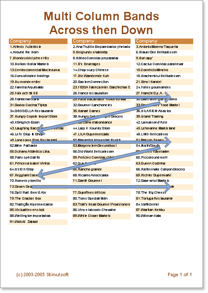
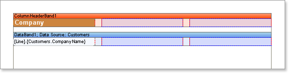
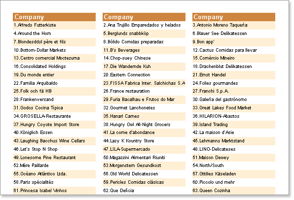

## AcrossThenDown Mode

This mode is used to output strings logically from left to right on the Data band. Strings are output one string to one column. When all columns on the Data band have been generated a new Data band will be formed and again all strings in columns will be output. The data will take up as much space in the report as is necessary.

* **Note:** The number of columns on a Data band is unlimited.

**Example**

In this example we will build a report with three columns on the Data band. Put two bands on a page: A **ColumnHeader** band and a **Data** band. On the **Data** band set the Column property to 3 (this will create three columns). Set the column width using the **ColumnWidth** property, and the space between columns using the **ColumnGaps** property.  Set the **ColumnDirection** property of the Data band to **AcrossThenDown** mode.

Place text components on the **ColumnHeader** band to represent the Column titles.

* **Note:** Column edges are indicated with red vertical lines. All components which are placed on the first column will be automatically repeated in the other columns.

Now run the report. It is very easy to see the direction of data output.

