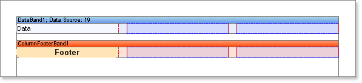
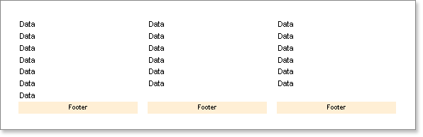

## Column Footer Band

The Footer band is normally used to output data footers, but there is also a special Column Footer band. The Footer band is output once after the Data band and contains only one set of data.  The Column Footer band is also output only once, but the components on this band are repeated beneath every column. It is used only for the columns positioned on the Data band.

* **Notice:** The ColumnFooter band is used for columns placed on the Data band. The Footer band for page columns has the same functionality.

**Example**

In this example we will build a report using a Column Footer band. Put two bands on a page: A Column Footer band and a Data band. On the Data band set the Column property to 3 (this will create three columns). Set the column width using the ColumnWidth property, and the space between columns using the ColumnGaps property.  Set the ColumnDirection property of the Data band to DownThenAcross mode.

Place a text component on the Column Footer band with the text 'Footer'. Then put a text component on the Data band with the text 'DATA'. . Do not forget that the red lines are the column edges.

Now run the report and you will see that the word "Footer" is shown under every column.  You need only create a single column footer and it will be automatically printed on each column.

