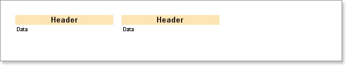

## PrintIfEmpty Property

Ugly output can result if the number of data rows is less than number of columns resulting in gaps on the page because the same number of column headers will be output as the number of columns. If there is data sufficient for two columns then only two headers will be output.

If you want to ensure that the same number of column headers are shown as the number of columns on a page without considering the number of strings available you can use the PrintIfEmpty property of the Column Header band. If you set this property to true, then one header will be output for each column regardless of the amount of available data.

* **Important:** It is important to remember that when the **MinRowsInColumn** property of the **DownThenAcross** mode is used, the report generator is not able to indicate the exact number of rows. Therefore, when using the **MinRowsInColumn** property, set the **PrintIfEmpty** property to true.
