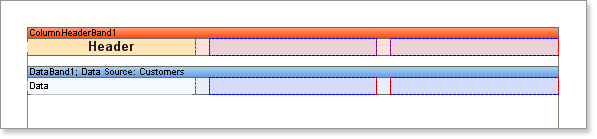
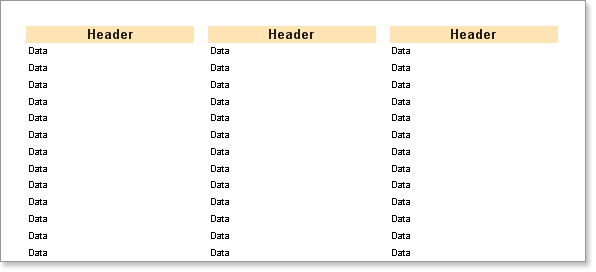

## Column Header Band

The Header band is normally used to output data headers, but there is also a special **Column Header** band. The Header band is output once before the Data band and contains only one set of data.  The **Column Header** band is also output only once, but the components on this band are repeated above every column. It is used only for the columns positioned on the Data band.

* **Notice:** The **Column Header** band is used for columns placed on the Data band. The Header band for page columns has the same functionality.

**Example**

In this example we will build a report using a **Column Header** band. Put two bands on a page: A **Column Header** band and a **Data** band. On the Data band set the Column property to 3 (this will create three columns). Set the column width using the **ColumnWidth** property, and the space between columns using the **ColumnGaps** property. Set the **ColumnDirection** property of the Data band to the **DownThenAcross** mode.

Place a text component on the **Column Header** band with the text 'Header'. Then put a text component on the **Data** band with the text 'DATA'. Do not forget that the red lines are the column edges.

Now run the report and you will see that the word "Header" is shown over every column.  You need only create a single column header and it will be automatically printed on each column.

