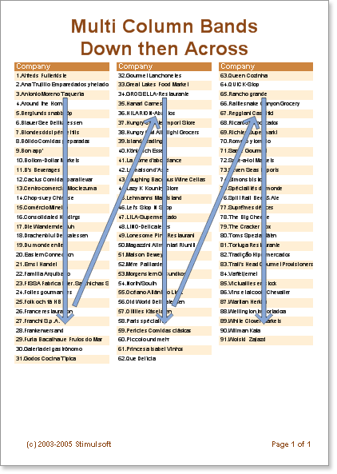
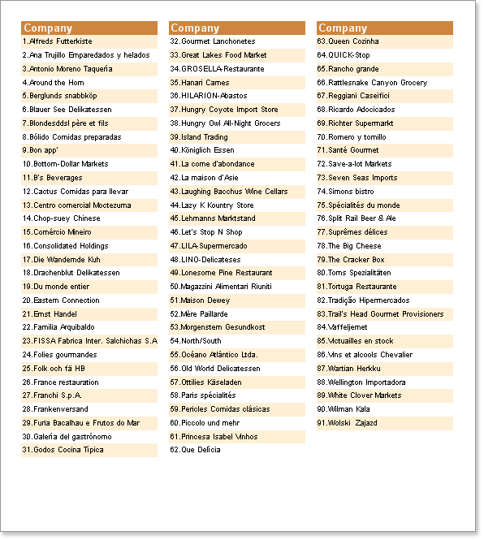

## DownThenAcross Mode

The **AcrossThenDown** mode has a weakness in that it is not always easy to read information on the page because the content is output from left to right and then down. It is often easier to read when columns are output using the DownThenAcross mode. In this mode the data is displayed in the first column and only when that is full is data shown in the second, and so on.

When using the DownThenAcross mode, the report generator tries to distribute data rows evenly across the columns. When all data rows have distributed between the columns the first column is output. Because the data is evenly distributed the first column may not reach the bottom of a page - the data will take as much space on a page as is required, and it will be represented in convenient readable form (unlike the AcrossThenDown mode).

* **Note:** The number of columns on a Data band is unlimited.

**Example**

In this example we will build a report with columns in DownThenAcross mode. Put two bands on a page: A ColumnHeader band and a Data band. On the Data band set the Column property to 3 (this will create three columns). Set the column width using the ColumnWidth property, and the space between columns using the ColumnGaps property.  Set the ColumnDirection property of the Data band to DownThenAcross mode.

Place text components on the ColumnHeader band to represent the Column titles.

* **Note:** Column edges are indicated with red vertical lines. All components which are placed on the first column will be automatically repeated in the other columns.

Now run the report. The report generator tried to distribute evenly all data rows between all three columns - using our sample data there are 31 rows in the first column, 31 in the second one, and 29 in the third. All information is readable top-down and from left to right.

