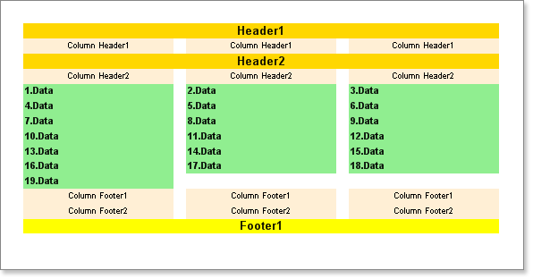

## AcrossThenDown Mode

In the AcrossThenDown mode all header bands are output in order of their position in the report template. In our example as shown below the Header1 band will be output first, then the ColumnHeader1 band will be output three times over the every column. Next the Header2 band is output, and then ColumnHeader2 band over the every column. Bands are output in order of their position on a page. This allows you to combine both types of header band to get the result you want. Footer bands are output differently. The Column Footers are output first. Then the Footer bands are output after all data rows. However, if the PrintOnAllPages property of the Footer bands is set to true, then the bands will be output in order of their position on a page.  It is important to remember that if the PrintOnAllPages property of the Footer band is set to false, then this band will be output only after all data rows.

