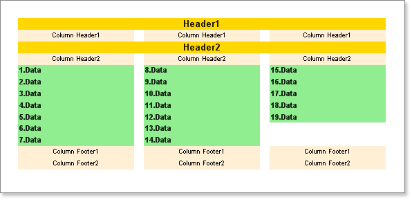

## DownThenAcross Mode

This mode is similar to the **AcrossThenDown** mode. All bands are output in the same order as they are placed on a page. However, if the **PrintOnAllPages** property of the Footer band is set to true, then all Footer bands are output in the same order as they are placed on page. If the **PrintOnAllPages** property of the Footer band is set to false, then only Column Footer bands are output and the Footer bands are ignored.

