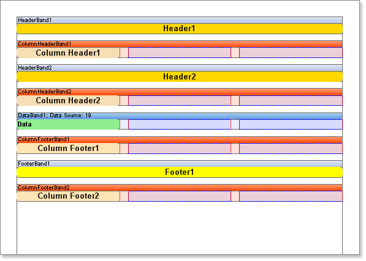

## Header and Footer Combinations

When outputting headers and footers for columns on a page  it is very important to consider what the order in which the bands will be output on the page.

To see this in action create a report using multiple Header bands, Footer bands, **Column Header** bands, **Column Footer** bands and just one **Data** band at a random order.

There are two modes used to output columns which will affect the output, and these will be reviewed in the following topics.
