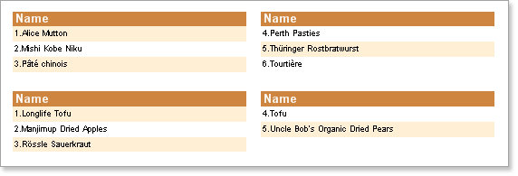
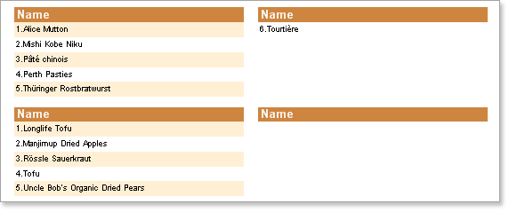

## Minimum Number Of Rows In Column

When using the Down Then Across column mode a situation could arise where there are too few rows are available to output evenly in a report. In some cases may be necessary not to distribute data rows equally across all columns for better visualization.

The **MinRowsInColumn** property of the Data band can be used to define the minimum permitted number of rows in the first column. By default the value of this property is set to 0 which means that there is no minimum number of data rows. If the value of this property is higher than 0 then no less than specified number of rows will be output in the first column.   In the example below the **MinRowsInColumn** property has been set to 5:

