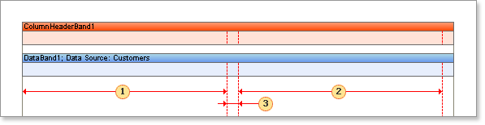

## Columns on Data Band

Columns have one disadvantage, which is that there may be situations where the available data is sufficient to fill only one column leaving other columns empty and that part of a page will stay unused. To get around this problem it is possible to output columns using the Data band.

The Columns property of the Data band is used to enable the output of data in columns. Set this property to 2 or more to cause the data to be output in a columnar format.

It will also be necessary to set the ColumnWidth and ColumnGaps properties. The ColumnWidth property is used to set the column width and is applied to all columns on the Data band. The ColumnGaps property is used to set the space between two columns.

* **Note:** Three data band properties have to be set to output columns on a band. The **Columns** property is used to define the number of columns, the **ColumnWidth** property is used to set the width of each column, and the **ColumnGaps** property is used to set the space between the columns.

 The first column width

 The second column width

 The space between columns

* **Note:** The number of columns on a Data band is unlimited.

There are two output modes for columns on the Data band: **AcrossThenDown** and **DownThenAcross**.
