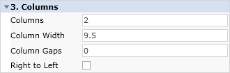
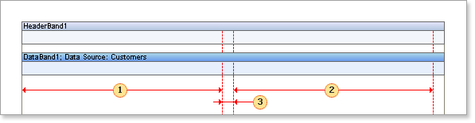
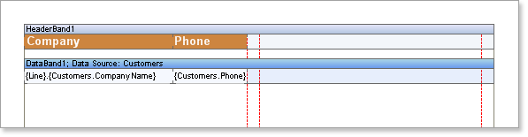
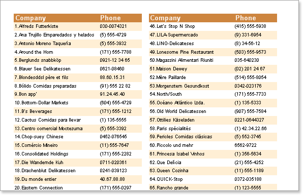
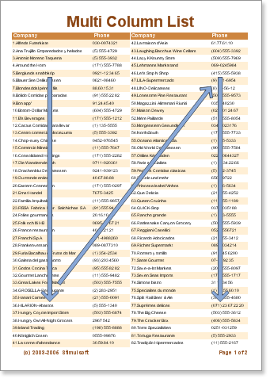

## Columns on Page

It is possible to output data on a page in columns using the **Columns** property. By default this property is set to 0. Setting the value to 2 or more will cause the data to be output in columns. You will also need to set the **ColumnWidth** and **ColumnGaps** properties.

The **ColumnWidth** property is used to set the column width and is applied to all columns which will be output on the page. The **ColumnGaps** property is used to set the space between the columns.

* **Important:** Three page properties have to be set to output columns on a page. The Columns property is used to define the number of columns, the **ColumnWidth** property is used to set the width of each column, and the **ColumnGaps** property is used to set the space between the columns.

|  | The first column width |
| --- | --- |
|  | The second column width |
|  | The space between columns |

In columnar output mode the page is separated vertically and the report is logically output in the first column, then in the second etc.

* **Note:** The number of columns on a page is unlimited.

**Example**

Suppose that you need a report with two columns. Set the **Columns** property to 2 (this means that two columns will be output on each page). Set the **ColumnWidth** to a suitable width for one column and in the **ColumnGaps** property set the space between columns. Put two bands on a page: a Header band and a Data band. The data headers will be output on the Header band and data itself will be output on the Data band.

* **Note:** Column borders are indicated by the red line.

Run the report. There are two columns on each page and all lines are numbered.

The columns are generated automatically - Stimulsoft Reports prints bands until there is no free space left on a page. Then, instead of creating a new page, a new column is added and data is output in a new column until again there is no free space. This is repeated until the required number of columns has been generated, at which point if there is still data to be output a new page is created and the process starts all over again.

