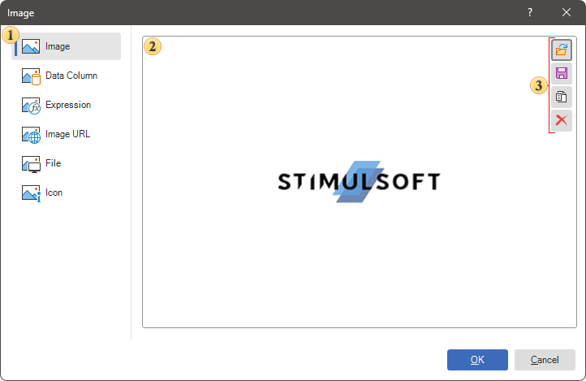
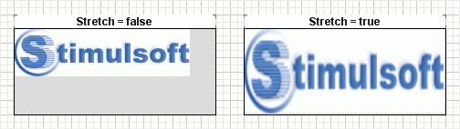
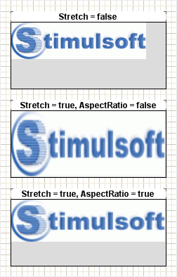

## Image

To enhance visual expressiveness and information perception, images are often included in reports. These images may consist of product visuals, employee photos, company logos, etc. In Stimulsoft Reports, the Image component is used to display these images. This component supports the following image types: BMP, PNG, JPEG, TIFF, GIF, ICO, EMF, SVG, and WMF. The Image component must be placed where the image needs to appear (e.g., report page, data band, header, footer, etc.).

To add a image to a report, follow these steps:

* Select the Image component from the Toolbox or the Insert tab in the Components group.

* Place this component on the report page or within the report band.

The Image component can be configured using:

* The [component editor](#editor), where the image source is selected.

* The [properties](#properties) associated with this component.

To open the editor, you should:

* Double-click the Image component.

* Select the Image component and choose the Design command from the context menu.

Image Editor

After opening the Image component editor, you need to define the source for the image. Below is an overview of the Image component editor:

 List of sources for the component. Each image source option is presented on a separate tab in the editor:

  * Image source.  Allows you to drag or open an image from local storage.

  * Data Column source. Allows you to select a data column from which images for this component will be obtained.

  * Expression source. Allows you to specify an expression that results in an image for this component. For example, an image can be obtained from a variable like {Variable1}. You can also use an expression to retrieve an image from a file by using the FromFile method of the Image component, e.g.,  {Image.FromFile("c:\Image.png")}.

  * Image URL source. Allows you to retrieve an image via a URL. You can also specify a link to report resources, such as resource://image, to load an image named "image" from the report resources.

  * File source. Allows you to load an image from a file by specifying the file path, e.g., d:\image.png.

  * Icon source. Allows you to select an icon from a set and define its color.

 Thumbnail area displays a sample image. This feature is not available for the Data Column and Expression sources.
 Controls:

  * Image source. Controls available include Open, Save, Move to Resource, and Remove.

  * Icon source. Includes a menu for selecting an icon and its color.

  * Expression and Image URL sources. Provides access to the text editor command.

  * File source. Offers the Browse command, which opens the local storage explorer.

  * Data Column source. Displays a tree of data sources and columns for selection.

> **Information**
>
> Please note that you can configure settings for different image sources. However, when generating a report, only the source with the highest priority will be used. The priority of sources is determined from top to bottom, meaning the Image source has the highest priority, while the Icon source has the lowest.

Additional panels
Additional panels can be displayed in the Image editor:

* Gallery panel. Displays a list of images as thumbnails from variables and resources. This panel is available only for the Image source.

* History panel. Shows a list of the most recently loaded images. This panel is available only for the File and Image URL sources.

Stretching images
When displaying images, the image dimensions often do not match the component dimensions. This can result in empty space left unfilled by the image. There are also instances where the image dimensions are larger than the component dimensions. In such cases, you can enable the mode to stretch the image to fit the component dimensions by setting the Stretch property to True.

After enabling the image stretch mode, the image dimensions will always match the component dimensions. However, this may distort the image proportions. To stretch the image while maintaining its original proportions, set the Aspect Ratio property to True. This ensures that the Image component will preserve the image proportions.

> **Information**
>
> The Aspect Ratio property only functions when the image stretch mode is enabled.

List of properties
Below is a list of properties for the component.

| Name | Description |
| --- | --- |
| Image | This property opens the component editor in the Image source tab. |
| Data Column | This property selects a Data Column for the component source. |
| File | This property opens the component editor in the File source tab. |
| Icon | This property selects an Icon for the component source. |
| Expression | This property opens the component editor in the Expression source tab. |
| Image URL | This property opens the component editor in the Image URL source tab. |
| Aspect Ratio | This property enables or disables the aspect ratio mode for the image. It is only relevant if the stretch mode is enabled. When set to True, the aspect ratio of the image within the component will be preserved. If set to False, the aspect ratio will not be maintained, and the image will be stretched without proportionality. |
| Horizontal Alignment | This property changes the horizontal alignment of the image in the current component. |
| Vertical Alignment | This property changes the vertical alignment of the image in the current component. |
| Image Rotation | This property rotates the image in the current component. |
| Margins | This group of properties is used to define the image boundaries relative to the component boundaries: Left, Right, Top, and Bottom. |
| Multiple Factor | This property sets the value to multiply by the image size. |
| Processing Duplicates | This property defines the mode of processing duplicates of the current image. |
| Smoothing | This property enables/disables anti-aliasing mode for images. |
| Stretch | This property enables or disables image stretching mode in the component. When stretching mode is enabled, you can choose whether to preserve the image proportions using the Aspect Ratio property. If set to True, the image will be stretched to fit the component. If set to False, the image will not be stretched. |
| Left | The indent of the current component from the left border of the page. The value is specified in report units. |
| Top | The indent of the current component from the top border of the page. The value is specified in report units. |
| Width | The width of the current component, specified in report units. |
| Height | The height of the current component, specified in report units. |
| Min Size | This group of properties is used to specify the minimum width and height for the current component. |
| Max Size | This group of properties is used to specify the maximum width and height for the current component. |
| Border | This group of properties is used to customize the display of the component's borders. You can define which sides of the border will be shown, as well as adjust the border color, thickness, and style. Additionally, you can configure the component's shadow. |
| Brush | This property changes the brush type and its settings for the current component. |
| Conditions | It is used to call the condition editor for the current component. To do this, click the Browse button in the value field of the current property. |
| Component Style | It is used to select a style for the current component. Also, in the list of values for this property, there is a command Edit Styles, which you may use to call the Style Designer. |
| Icon Color | This property selects a color for the icon. Relevant if the icon is defined as a source for the Image component. |
| Use Parent Style | It is used to apply a style to the current component This style is applicable to the owner component. If the current property is set to True, the style of the owner component will be applied to the component. If the current property is set to False, the assigned style will be applied to the component. |
| Anchor | It is used to select the binding mode of the current component to the owner component. |
| Can Break | This property determines whether the component can break content across multiple pages. |
| Can Grow | Automatically increases the height of a component. |
| Can Shrink | Automatically reduces the height of a component. |
| Dock Style | It is used to select the mode of docking of the current component with the owner component. |
| Enabled | It processes the current component when rendering a report. If the current property is set to True, the component will be processed when the report is rendered. If the current property is set to False, then the component will not be processed when rendering the report. |
| Grow to Height | Increases or decreases the height of a component when rendering a report. If the current property is set to True, the component will stretch to the height of the owner component. If the current property is set to False, then the component will not stretch to the height of the owner component. |
| Interaction | Calls the interaction editor for the current component. click the Browse button in the value field of the current property. |
| Printable | Shows or hides the current component in the rendered report. If the current property is set to True, the component will be displayed in the rendered report. If the current property is set to False, then the component will not be displayed in the generated report. |
| Print On | It is used to specify the display mode of the current component in the rendered report. |
| Shift Mode | It is used to offset a component that sits below another component at the same level in the report component hierarchy. |
| Name | It is used to change the name of the current component in the report. |
| Alias | It is used to change the alias of the current component in the report. |
| Restrictions | Configures the rights to use the current component: The Allow Change parameter enables or disables the changes of the component. The Allow Delete parameter is used to enable or disable the deletion of the component. The Allow Move parameter is used to enable or disable moving of the component. The Allow Resize option is used to enable or disable resizing of the component. The Allow Select parameter is used to enable or disable selecting of the component. |
| Locked | Prevents or allows resizing and moving the current component. If the property is set to True, then the current component cannot be moved or resized. If this property is set to False, then this component can be moved and resized. |
| Linked | It is used to bind the current location to a report page or other component. If the property is set to True, then the current component is bound to the current location. If this property is set to False, then this component is not bound to the current location. |
