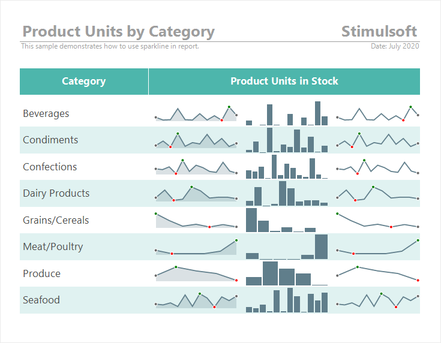
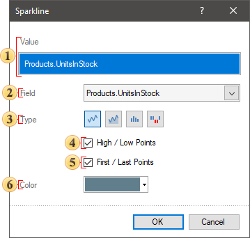

## Sparkline

The Sparkline component is a visual tool to display data. Unlike charts, a sparkline does not contain data values, axis labels, legend, and other elements.

To add a sparkline to the report, you should do the following:

* Select the Sparkline component on the Toolbox or the Insert tab in the Components group;

* Place this component on the report page or the Data band.

> **Information**
>
> When placing the Sparkline component on the Data band, you should specify the relationship between their data sources. You can do this using the Data Relation property of the Sparkline component.

A sparkline in reports can be of the following type:

* Line - the values of the specified data column will be displayed as a line graph;

* Area - the values of the specified data column will be displayed as an area;

* Column - the values of the specified data column will be displayed as a column chart;

* Win/Loss - the values of the specified data column will be displayed as positive and negative blocks.

You may configure the Sparkline component the following way:

* [In the component editor](#editor) (double-click on the current component in the report).

* Using the [properties of the component](#tableofproperties). Select the component in the report and change the required values on the Property panel.

The Sparkline editor

In the editor of the current component, the component is visually configured.

 The Value field specifies the data column, based on the values ​​of which the sparkline is created.

 In the current field, you can change the data column for the sparkline values.

 The Type field contains controls that you can use to change the type of sparkline.

 The High/Low Points parameter is used to display the maximum and minimum value markers on a Line or Area sparkline.

 The First/Last Points parameter is used to display the first and last value markers on a sparkline of the Line or Area type.

 The Color parameter is used to change the color of the sparkline. You can specify the color of positive and negative values for a sparkline of Column or Win/Loss types.

The list of properties

See the list below which shows the properties of the current component.

| Name | Description |
| --- | --- |
| Value Data Column | It is used to change the data column by the values of which the sparkline is created. |
| Data Relation | It is used to select a relation between data sources of the Data band and Sparkline components. If there is no relation between these data sources,[you can create it](../../Getting_Started/Creating_Relation.md) from the relation dialog by clicking the New Relation button. |
| Left | Specifies the indent of the current component from the left border of the page. The value is specified in the report units. |
| Top | Specifies the indent of the current component from the top border of the page. The value is specified in the report units. |
| Width | Specifies the width of the current component. The value is specified in the report units. |
| Height | Specifies the height of the current component. The value is specified in the report units. |
| Min Size | A group of properties is used to specify the minimum width and height for the current component. |
| Max Size | A group of properties is used to specify the maximum width and height for the current component. |
| Conditions | It is used to call the condition editor for the current component. To do this, click the Browse button in the value field of the current property. |
| Component Style | It is used to select a style for the current component. Also, in the list of values for this property, there is a command Edit Styles, which you may use to call the Style Designer. |
| Use Parent Style | It is used to apply a style to the current component This style is applicable to the owner component. If the current property is set to True, the style of the owner component will be applied to the component. If the current property is set to False, the assigned style will be applied to the component. |
| Anchor | It is used to select the binding mode of the current component to the owner component. |
| Dock Style | It is used to select the mode of docking of the current component with the owner component. |
| Enabled | It processes the current component when rendering a report. If the current property is set to True, the component will be processed when the report is rendered. If the current property is set to False, then the component will not be processed when rendering the report. |
| Grow to Height | Increases or decreases the height of a component when rendering a report. If the current property is set to True, the component will stretch to the height of the owner component. If the current property is set to False, then the component will not stretch to the height of the owner component. |
| Interaction | Calls the interaction editor for the current component. click the Browse button in the value field of the current property. |
| Printable | Shows or hides the current component in the rendered report. If the current property is set to True, the component will be displayed in the rendered report. If the current property is set to False, then the component will not be displayed in the generated report. |
| Print On | It is used to specify the display mode of the current component in the rendered report. |
| Shift Mode | It is used to offset a component that sits below another component at the same level in the report component hierarchy. |
| Name | It is used to change the name of the current component in the report. |
| Alias | It is used to change the alias of the current component in the report. |
| Restrictions | Configures the rights to use the current component: The Allow Change parameter enables or disables the changes of the component. The Allow Delete parameter is used to enable or disable the deletion of the component. The Allow Move parameter is used to enable or disable moving of the component. The Allow Resize option is used to enable or disable resizing of the component. The Allow Select parameter is used to enable or disable selecting of the component. |
| Locked | Prevents or allows resizing and moving the current component. If the property is set to True, then the current component cannot be moved or resized. If this property is set to False, then this component can be moved and resized. |
| Linked | It is used to bind the current location to a report page or other component. If the property is set to True, then the current component is bound to the current location. If this property is set to False, then this component is not bound to the current location. |
