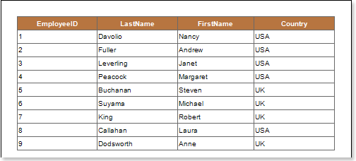
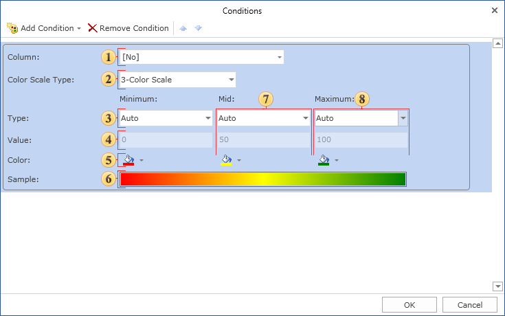
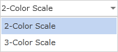
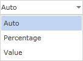
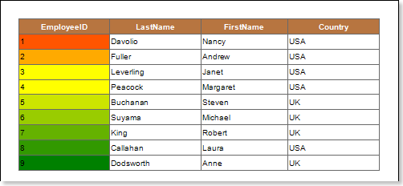

## Color Scale Condition

The Color Scale Condition allows selecting a component with a color in the rendered report, to which will this condition corresponds. The Color Scale Condition is working according to the the following principle: if the color scale consists of 2 colors (minimum and maximum), then the minimum and maximum values for selected data columns are specified. Values that correspond to the maximum and minimum values are indicated with colors. For other values, which are taken from selected data columns, the location in the color scale is calculated.Depending on location in color scale, the color is assigned to this value, so the color is assigned to the component. If the minimum value is equal to or less than the specified minimum in the condition, that means it will be a boundary minimum value and will use the color, chosen for the minimum value. If the maximum value in the data column is equal to or greater than the specified maximum in the condition, then it will be a maximum boundary value, and will use the color selected for a maximum value. If the value is in the middle between the minimum and maximum value, then the background color of a component with this value will be an interpolated color for minimum and maximum values. If the color scale consists of 3 values (low, medium, high), then the minimum, medium and maximum values are defined. For each value, which is taken from the selected data column, the position in the color scale is calculated depending on the location of the value and the color is assigned. So the color of the component is changed. The color scale represents a smooth transition between the three colors: the color from minimum to medium, and the color from medium to maximum. The background color of a component with a value that is strictly in the middle between the minimum and average value will be an interpolated color of minimum and medium values. The background color of a component with a value that is strictly in the middle between the average and maximum value will be an interpolated color of medium to maximum values. The picture shows a report page:

Add the Color Scale Condition. To do this, select a text component, for example a component with the {Employees.EmployeeID} expression. Add a Color Scale Condition. Change the parameters of the condition. The picture below shows the Conditions dialog:

 The **Column** field. This field indicates the data column from which the value for the condition will be taken;

 The **Color Scale Type** fields provides an opportunity to choose the type of color scheme: 2-color scales, or 3-color scales. The picture below shows the menu to select the type a of color scale:

 The **Type** field provides an opportunity to change the type of a value that will be specified in the Value field for a minimum color scale. The picture below shows the menu to select  the type of a value:

 The **Value** field. Used for a minimum color scale;

 The **Color** filed. Used for a minimum color scale;

 The **Sample** field. Shows a color scale in the report how it will look like from minimum to medium and from medium to maximum. If you select the color scale 2-color scales, then in this field a color gradient from minimum to maximum will be displayed;

 A group of parameters (Type, Value, Color) of the medium color scale;

 A group of parameters (Type, Value, Color) with a maximum color scale.

After making changes in the report template, the report engine will perform conditional formatting of text components, according to the specified parameters. In this case, depending on the value of the component, the background of a text component will be changed. The picture below shows a rendered page of the report with conditional formatting:

As can be seen in the picture above, the background color depending on the value in a color scale is changed in text components.
