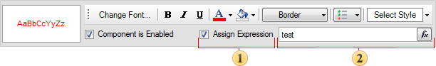

## Conditional Formatting And Text Components

The conditions editor of text components has differences from other components. It has additional ability to assign text expression, if the condition is true. On the picture below the panel to edit conditions of the text component is shown.

 Assign expression. This flag controls whether or not a text expression is used in the condition. If it is disabled then the expression is not used.

 Text expression. The text expression that will be assigned to a text component if the condition is true.
