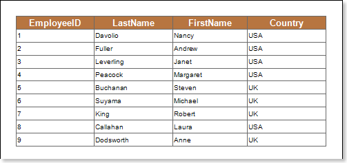
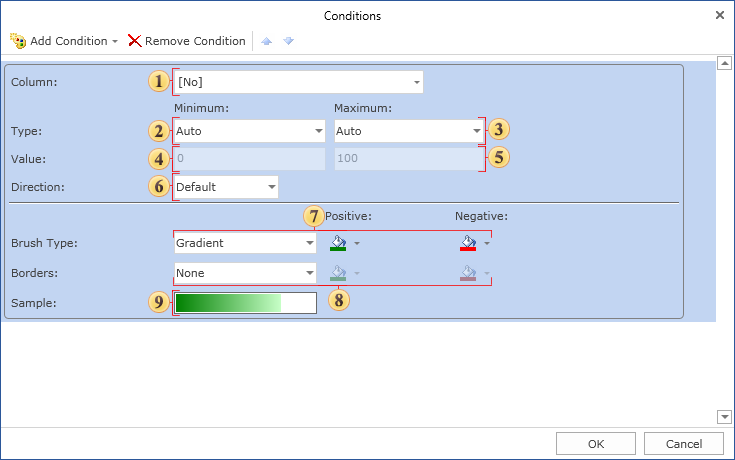
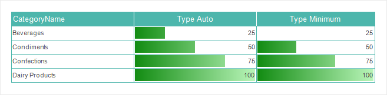
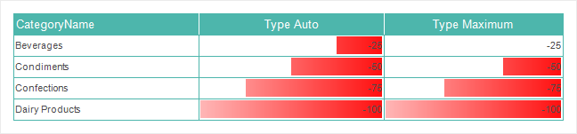
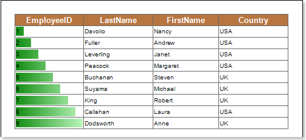
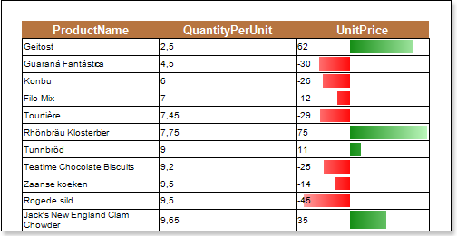
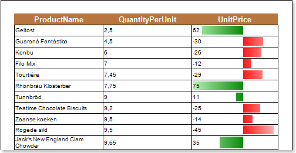

## Data Bar Condition

The Data Bar condition provides an opportunity to visually display the dynamics of changing values of a data column. The Data Bar condition works following principles described below. All the values in the selected data column are analyzed, the minimum and maximum values are  determined. Minimum corresponds to 0 percent, maximum - 100 percent. When drawing each component, to which this condition is applied, a value from the selected data column will be specified. Then, the percentage of this value is calculated from the minimum to maximum range. Depending on the percentage, the Data Bar is rendered. If the value is close to the maximum, the greater length a data bar would be. If the value is close to or equal to a minimum value, the data bar will be almost unfilled. The picture below shows a report page:

Add the Data Bar condition. To do this, select a text component, for example a text component with the {Employees.EmployeeID} expression. Add the Data Bar expression. Change parameters of the condition. The picture below shows the Conditions dialog box:

 The **Column field**. This field indicates the data column from which values will be taken for drawing the Data Bar.

 The **Type field** is used to change the type of a minimum value. The following types are available:

* **Auto** defines the minimum value in the selected data column, and if it is greater than zero, then reset to zero. Thus, if the data column has 25 as the minimum number and 100 as the maximum. In the component with a minimum number, the histogram will be rendered by 25 per cent. With this type, the extreme range of the value is 0.

* **Percentage** is used to specify a minimum value as a percentage;

* **Value** provides an opportunity to specify a minimum value as a numerical value,

* **Minimum** defines the minimum value in the selected data column and does not reset it to null. Thus, if the data column has 25 as the minimum number and 100 as the maximum. In the component with a minimum number, the histogram will not be rendered because 25 is the extreme value of the range.

 The **Type** field is used to change the type of a maximum value. The following types are available:

* **Auto** defines the minimum value in the selected data column, and if it is less than zero, then reset to zero. Thus, if the data column has -25 as the maximum number and -100 as the minimum. In the component with a maximum number, the histogram will be rendered by 25 per cent. With this type, the extreme range of the value is 0;

* **Percentage** is used to specify a maximum value as a percentage;

* **Value** provides an opportunity to specify a maximum value as a numerical value;

* **Maximum** defines the maximum value in the selected data column and resets it to null. Thus, if the data column has -25 as the maximum number and -100 as the minimum. In the component with a maximum number, the histogram will not be rendered because -25 is the extreme value of the range.

> **Video**
>
> * **Notice**: The difference between the **Auto** from the **Maximum** and **Minimum** may be noticeable only in a certain range of numbers.

 The **Value field** for a minimum value.

 The **Value field** for a maximum value.

 The **Direction field** is used to change the direction of drawing the Data Bar. The following directions are available: Left to Right, Right to Left, Default defines the direction of the Data Bar, depending on the Right to Left property of the text component.

 The **Data Bar** parameters include: the Brush Type is used to choose the brush type (gradient or solid); the Positive field is used to change the color a Data Bar for positive values;  the Negative field is used to change the color a Data Bar for negative values.

 The **Borders** parameter include: the Borders field is used to choose the type of a border (none or solid); the Positive field is used to change the border color a Data Bar for positive values;  the Negative field is used to change the border color a Data Bar for negative values.

 The **Sample field** shows an example of a Data Bar.

After making changes in the report template, the report engine will perform conditional formatting of text components, according to the specified parameters. The picture below shows a page of the rendered report with conditional formatting:

As can be seen from the picture above, the EmployeeID value includes the numbers from 1 to 9, where 1 is the minimum value, and 9 is the maximum one. And according to the changing dynamics of values a data bar will be drawn.

Negative values

In the data column from which values are taken when displaying the histogram may be found both positive and negative values. In this case, analysis of all the values in the selected column of data is determined by the minimum and maximum values. The minimum value is 0 per cent, maximum is 100 per cent. Next, we determine a zero, ie beginning from which a histogram of negative and positive values. For example, the minimum value is -1, while the maximum is three, ie percentage of negative values in the absolute values of band reception is 25 percent and 75 percent positive. Hence the beginning, from which will be constructed histogram is 25 per cent of the length of the component from its left border and 75 percent of the length of the component from its right boundary (at the direction of the histogram from left to right). Histogram of negative values will be rendered in a color that is selected in the Negative, and the histogram of positive values of a color that is selected in the Positive. The picture below shows an example of a rendered report with negative and positive values:

The picture below shows an example of a rendered report with negative and positive values:

As can be seen in the picture above, the background color depending on the value in a color scale is changed in text components.
