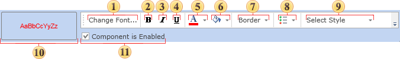

## Defining Formatting

If the condition returns true when evaluated by the report engine the formatting of the component will be changed according to the design settings. Setting is carried out using the formatting panel. The picture below shows the components of the control panel:

 Font. Used to select the font.

 Bold button. Used to define the bold font style.

 Italic button. Used to define the italic font style.

 Underlined button. Used to define the underlined font style.

 Font Color Selector. Used to define the text color.

 Background Color Selector. Used to define the background color.

 Border. Used to set borders.

 Control Menu. Enables/Disables the components of the control panel.

 Style button. This button is used to select a style to be applied.

 Pattern. This shows a preview of how the control will look with the conditional formatting applied.

 Component is Enabled check box. This control lets to control how the result of a condition would affect on the Enabled property of the component.

You can enable or disable the accessibility of the component in a report. For example, you can remove a page from a rendered report by setting a condition.

If the condition evaluates to true, then the component appearance will change according to settings made in this panel. If the component does not support the specified appearance (for example, because it has no Font property), the appearance will be automatically deleted.

In addition, you can control the availability of the control within the report using the Component is Enabled check box.
