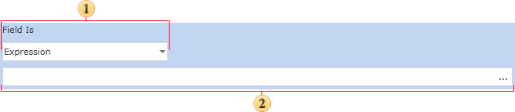

## Expression Condition

When you choose to use an Expression condition you define a text expression that returns a boolean value. The value returned determines whether or not the formatting is applied. The configuration panel is shown below:

 **Field Is.** Field is used to select the type of conditions.

 **Expression.** This field is used to define an expression that should return a boolean value.

For example, a suitable expression in **C#**:

Customers.CustomerName == "MyCustomer"

If the expression cannot return a boolean value then the report generator will not be able to render the conditional formatting.

* **Important:** The expression MUST return a boolean value or the conditional formatting will fail.
