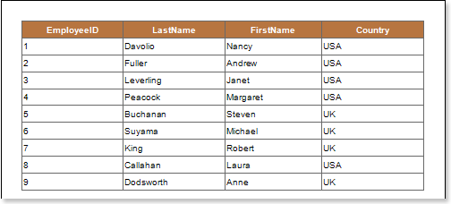
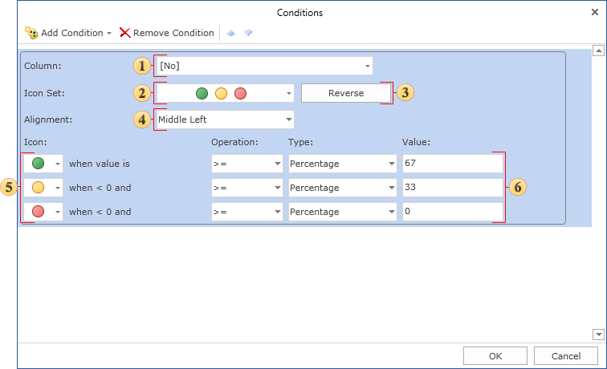
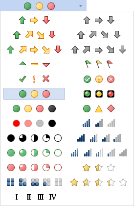
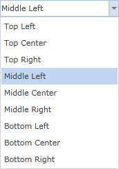
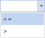
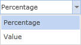
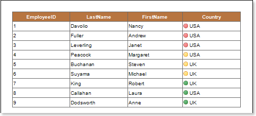

## Icon Set Condition

The **Icon Set** condition is used to identify the component with an icon to which a condition is applied. The **Icon Set** works the following way. The minimum and maximum values for all values in the selected data column are defined first. All calculated values are in the range from 0 to 100 percent. A group of icons is selected. Then, the condition and boundary values (for example 33 per cent and 67 per cent) for each icon are set. If, for example, a group of three icons is selected, each of these selected icons have a subrange. In this case, each of the icons has subrange in 33 percent (from 0 to 33, from 33 to 67, from 67 to 100). This allows you to mark a component with an appropriate icon depending on the value. The picture below shows a report page:

Add an **Icon Set** condition. To do this, select a text component, for example a component with the **{Employees.Country}** expression. Add the **Icon Set** condition. Change the parameters of the condition. The picture below shows the **Conditions** dialog:

 The **Column** field. This field is used to choose a data column from which values for the condition will be taken. For example, choose the **{Employees.EmployeeID}** data column;

 A menu used for selecting a group of icons. The picture below shows the menu of selecting icons:

 The **Reverse** button is used to change the location of icons in reverse order. The order of the icons is displayed in the  Icon field.

 The **Alignment** field is used to align icons in text components. The picture below shows the Alignment menu options:

 The **Icon** field shows the order of icons, and provides an opportunity to change the icon for each value in the report;

 A sub-condition, includes: the Operation, Type, and Value fields. In this case, this is the first sub-condition. The Operation field is used to change the type of operation of the first sub-condition. The picture below shows the operations menu:

The Type field is used to change the type of a value of the first sub-condition. There are two values: Percentage and Value. The picture below shows the menu to select the type of a value:

In the Value filed the value of a sub-condition is indicated.

 A **sub-condition** includes: the Operation, Type, and Value fields. In this case, it is the second sub-condition.

After making changes in the report template, the report engine will perform conditional formatting of text components, according to the specified parameters. In this case, the appropriate icon for a text component will be applied. The picture below shows a page of the rendered report with conditional formatting:

As can be seen in the picture above, the icon depending on the value of a condition will be applied to each text component.
