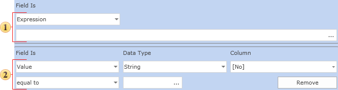

## Multi Part Conditions

In some cases, one comparison operation may not be sufficient to define the condition. To allow for this situation Stimulsoft Reports allows you to specify a multi part condition. The picture below shows the condition editor a two level multi part condition:

 The first part of the condition.

 The second part of the condition.

If you were to write this condition in code as a logical expression, it would look like this:

(Categories.CategoryID) = 1 or (Categories.CategoryID = 2)

It is possible to select the type of logical addition of the various parts of a multi part condition: the logical AND or the Boolean OR.  To define this simply select the appropriate radio button

