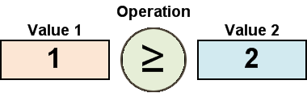
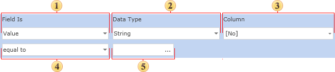

## Value Condition

If you use a Value condition you will need to set the condition using a special format which consists of three elements:

1. The column in the data source

The column in the data source from which the first value is taken for comparison with the second value of the condition.

1. Operator

The selected operator lets the reporting tool to know how to process the first and second values to obtain the result. For example, the comparison operator tells to the reporting tool to compare the first and the second values to produce the result.

1. The value to calculate a condition

This is the second value used to calculate the condition (the first is taken from the data source). The value can be either a constant (for all types of data except for the Expression type), or an expression (for the Expression type).

If you were writing a value condition in code, it would look like this:

For several types of operation three values are used in calculating the condition. These are operations in which the value is checked to determine whether or not it is within a specified range, defined by two values. In addition to the elements described, the condition also includes a data type. The data type helps the reporting tool to identify the type of the second condition, and to automatically modify the list of available types of conditional operator. The picture below shows the panel used to set a value condition:

 Field Is combo.

This is used to select the type of condition.

 Data Type combo

This field specifies the type of data with which a condition will work. There are five types of data: String, Numeric, DateTime, Boolean, and Expression. The data type affects how the reporting tool processes the condition. For example, if the data type is a string, then the methods that work with strings are used. In addition, depending on the type of data the list of available operators is automatically changed. For example, the Contains operator is available only for the String data type. The Expression data type provides the ability to specify an expression instead of the second value. In this case the reporting tool will not check the compatibility of the first and the second values of the condition. Therefore, the user should ensure that the expression entered is valid to prevent runtime errors.

 Column combo

This is used to specify the column of the data source. The value of the column will be used as the first value of the condition.

 Operator combo

This is used to specify the type of operator to be used when calculating the value of the condition.

 Value box

This is used to specify the comparison value to be used when calculating the value of a condition. For some operations you may need to specify three values.
