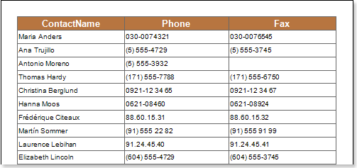
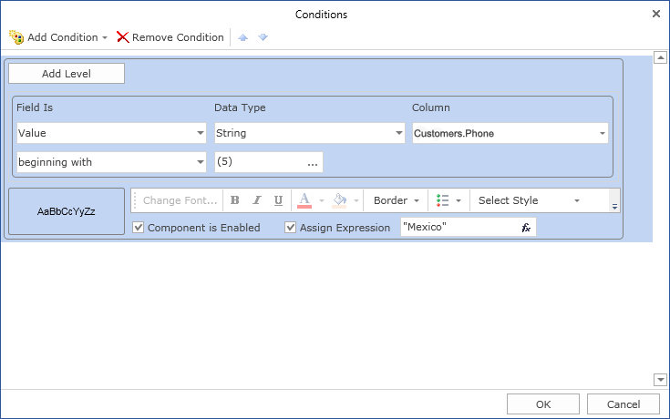
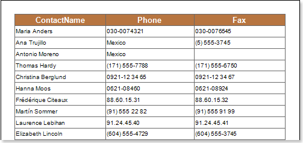

## Assigning Expression

Using conditional formatting it is possible, in a text component, to change the text, replace its textual expression on a text expression, specified in the condition. The picture below shows a report page:

For example, it is necessary to assign an expression to all text components, which entries in the **Phone** column will start with the (**5**) characters. Select a text component with the **{Customers.Phone}** expression in the **DataBand** and call the **Conditions** editor. Then, you should set a condition: select the **Customers.Phone** column data, as the first value, and specify the (**5**) character, as a second value. Also set the **Operation comparison** to the **Beginning with** value. Change the formatting options, in this case, enable the **Assign Expression** and specify an expression to which it will be replaced on. For example, specify the "Mexico" expression. The picture below shows the **Conditions** editor dialog box:

After making changes in the report template, the report engine will perform conditional formatting of text components, according to the specified parameters. In this case, assigning of the text expression in the text components that match the specified condition will be done. The picture below shows a page of the rendered report with conditional formatting:

As can be seen in the picture above, assigning of expressions in the text components of the **Phone** column which entries start with the (**5**) character will be done.
