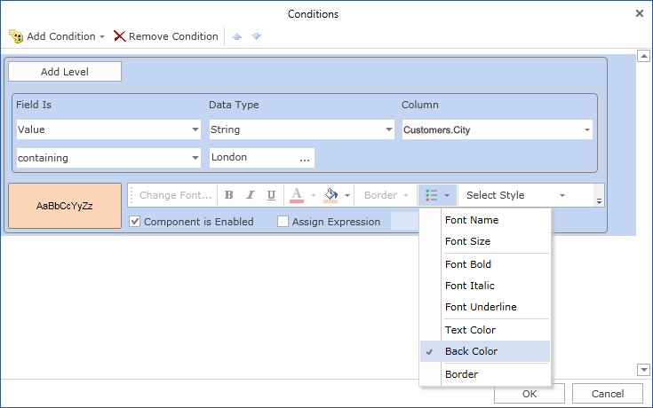
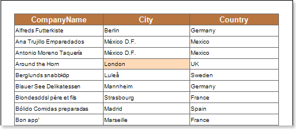

## Back Color

Using conditional formatting it is possible to apply the background color for the text component. The picture below shows a report page:

For example, you can change the background color of text components which contain a **London** word in the **City** column. Select a text component with the **{Customers.City}** expression, in the **DataBand** and call the **Conditions** editor. Then, you should set a condition: select the **Customers.City** data column, as the first value, and indicate the **London** word, as a second value. Also set the **Operation comparison** to the **containing** value. Change the formatting parameters, in this case, change the background color. The picture below shows the **Conditions** editor dialog box:

After making changes in the report template, the report engine will perform conditional formatting of text components, according to the specified parameters. In this case, the background color will be applied for the content of text components that match the specified condition. The picture below shows a page of the rendered report with conditional formatting:

As can be seen in the picture above, background color of text components of the **City** column which contain the **London** word, will be changed.
