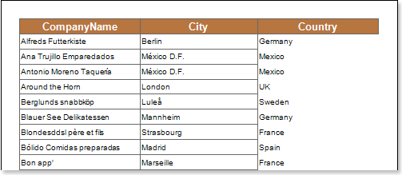
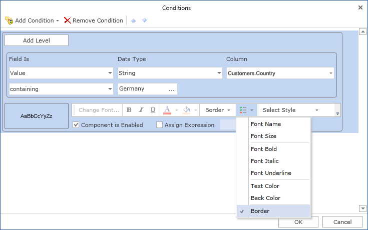
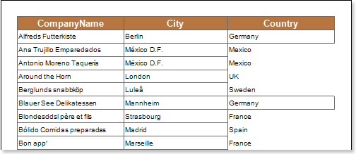

## Borders

Using conditional formatting it is possible to apply borders for the text component. The picture below shows a report page:

For example, you can set borders of text components which contain a Germany word in the Country column. Select a text component with the {Customers.Country} expression, in the DataBand and call the Conditions editor. Then, you should set a condition: select the Customers.Country data column, as the first value, and indicate the Germany word, as a second value. Also set the Operation comparison to the containing value. Change the formatting parameters, in this case, set borders. It is possible to configure showing borders. The following options are available: All (show all borders), None (Do not show borders), Top (show a top border), Left (show a left border), Bottom (show a bottom border), Right (show a right border). The picture below shows the Conditions editor dialog box:

After making changes in the report template, the report engine will perform conditional formatting of text components, according to the specified parameters. In this case, the borders will be set for the text components that match the specified condition. The picture below shows a page of the rendered report with conditional formatting:

As can be seen in the picture above, borders of text components of the Country column which contain the Germany word, will be set.
