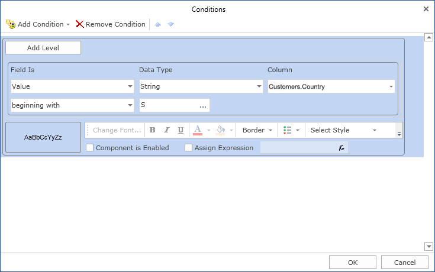
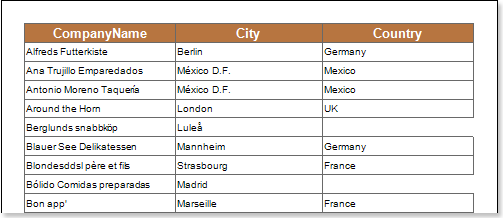

## Enabling Component

Using conditional formatting it is possible to show/hide the text component. The picture below shows a report page:

For example, you can hide the text components which contain a **S** letter in the **Country** column. Select a text component with the **{Customers.Country}** expression, in the **DataBand** and call the **Conditions** editor. Then, you should set a condition: select the **Customers.Country** data column, as the first value, and indicate the **S** letter, as a second value. Also set the **Operation comparison** to the **Beginning with** value. Change the formatting parameters, in this case, uncheck the **Component Is Enabled** check box. The picture below shows the **Conditions** editor dialog box:

After making changes in the report template, the report engine will perform conditional formatting of text components, according to the specified parameters. In this case, the borders the text components that match the specified condition will be hidden. The picture below shows a page of the rendered report with conditional formatting:

As can be seen in the picture above, the text components of the **Country** column which lines start with the **S** letter are changed.
