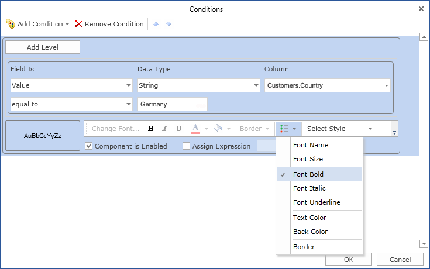
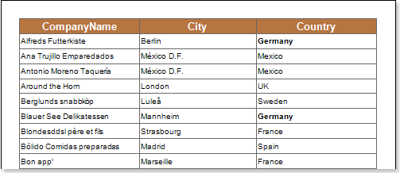

## Font Bold

Using conditional formatting it is possible to apply the bold font for the text component. The picture below shows a report page:

For example, you can make a text bold for components that contain the Germany word in the Country column. Select a text component with the {Customers.Country} expression, in the DataBand and call the Conditions editor. Then, you should set a condition: select the Customers.Country data column, as the first value, and indicate the Germany word, as a second value. Also set the Operation comparison to the Containing value. Change the formatting parameters, in this case, set the font style to bold. The picture below shows the Conditions editor dialog box:

After making changes in the report template, the report engine will perform conditional formatting of text components, according to the specified parameters. In this case, the bold font will be applied for the content of text components that match the specified condition. The picture below shows a page of the rendered report with conditional formatting:

As can be seen in the picture above, lines of text components of the Country column which contain a Germany word are bold.
