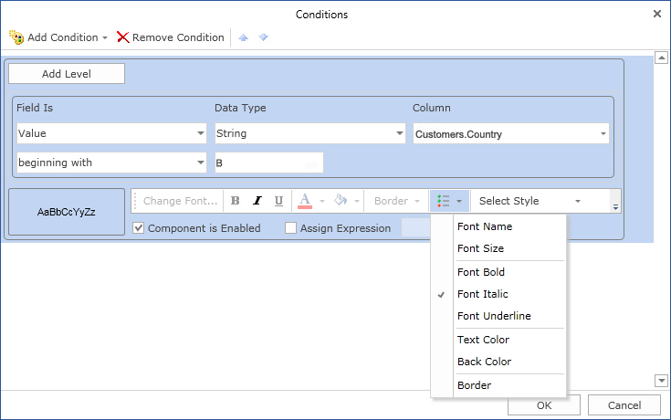
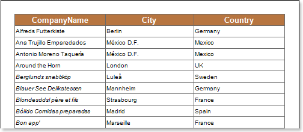

## Font Italic

Using conditional formatting it is possible to apply the italic font for the text component. The picture below shows a report page:

For example, you can make a text italic for components that contain a **B** letter in the **CompanyName** column. Select a text component with the **{Customers.CompanyName}** expression, in the **DataBand** and call the **Conditions** editor. Then, you should set a condition: select the **Customers.CompanyName** data column, as the first value, and indicate the **B** letter, as a second value. Also set the **Operation comparison** to the **Beginning with** value. Change the formatting parameters, in this case, set the font style to italic. The picture below shows the **Conditions** editor dialog box:

After making changes in the report template, the report engine will perform conditional formatting of text components, according to the specified parameters. In this case, the italic font will be applied for the content of text components that match the specified condition. The picture below shows a page of the rendered report with conditional formatting:

As can be seen in the picture above, lines of text components of the **CompanyName** column which starts with a **B** letter are italic.
