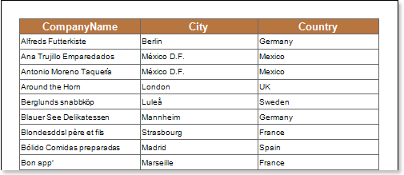
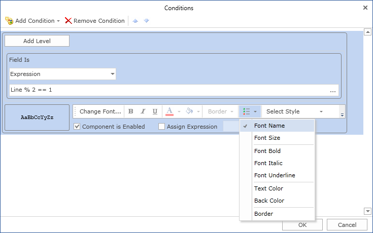
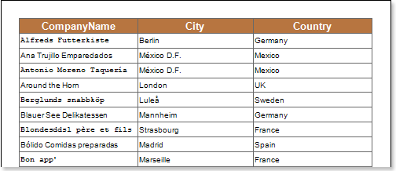

## Font Name

Using conditional formatting it is possible to change the font of a text component. The picture below shows a report page:

For example, you can use different fonts to display the contents of a text component in the odd and even rows. To do this, select a text component, for example a text component with the **{Customers.CompanyName}** expression, in the **DataBand** and call the **Conditions** editor. Then, you must specify the condition, for example: **Line % 2 == 1**. Change the formatting options, in this case, the Font Name. The picture below shows the **Conditions** editor dialog box:

After making changes in the report template, the report engine will perform conditional formatting of text components, according to the specified parameters. In this case, the font of the selected text component will be changed, depending on the condition. The picture below shows the page of the rendered report with conditional formatting:

As can be seen in the picture above, the text components of the **CompanyName** column, located in the even and odd lines, use different fonts.
