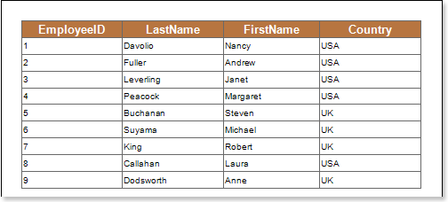
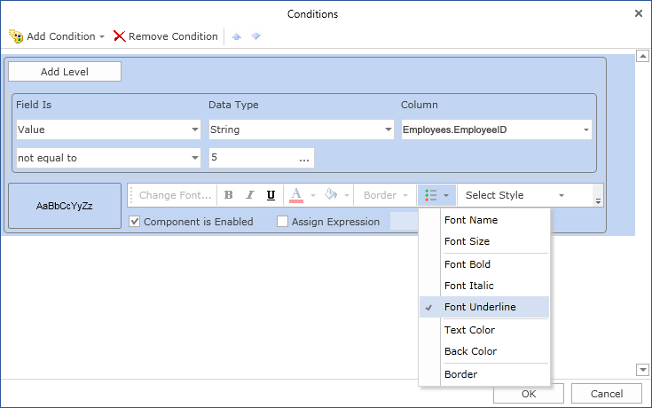
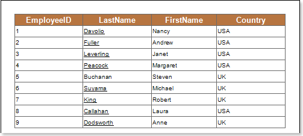

## Font Underlined

Using conditional formatting it is possible to apply the underlined font for the text component. The picture below shows a report page:

For example, you can make a text underlined for components that contain a Nancy word in the FirstName column. Select a text component with the {Employees.LastName} expression, in the DataBand and call the Conditions editor. Then, you should set a condition: select the Employees.FirstName data column, as the first value, and indicate the Nancy letter, as a second value. Also set the Operation comparison to the not equal to value. Change the formatting parameters, in this case, set the font style to underlined. The picture below shows the Conditions editor dialog box:

After making changes in the report template, the report engine will perform conditional formatting of text components, according to the specified parameters. In this case, the underlined font will be applied for the content of text components that match the specified condition. The picture below shows a page of the rendered report with conditional formatting:

As can be seen in the picture above, lines of text components of the FirstName column which starts with the Nancy word are underlined.
