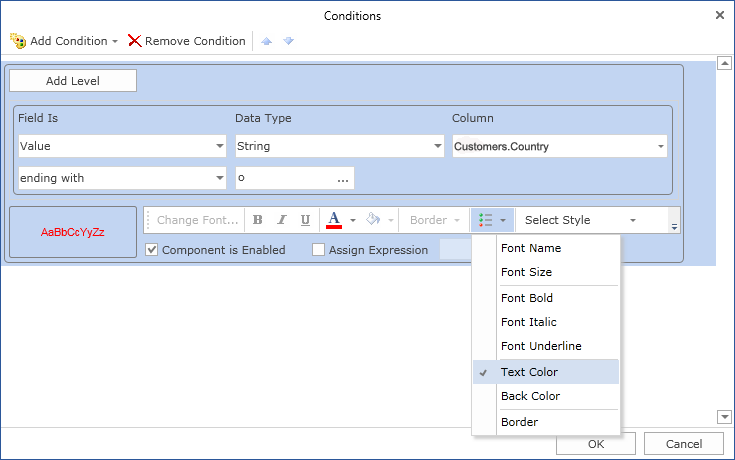
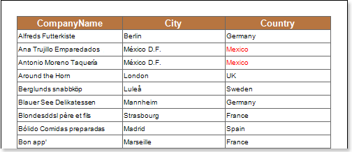

## Text Color

Using conditional formatting it is possible to apply the color for the text component. The picture below shows a report page:

For example, you can change a text color of entries which ends with an **o** letter in the **Country** column. Select a text component with the **{Customers.Country}** expression, in the **DataBand** and call the **Conditions** editor. Then, you should set a condition: select the **Customers.Country** data column, as the first value, and indicate the **o** letter, as a second value. Also set the **Operation comparison** to the **ending with** value. Change the formatting parameters, in this case, change the text color. The picture below shows the **Conditions** editor dialog box:

After making changes in the report template, the report engine will perform conditional formatting of text components, according to the specified parameters. In this case, the text color will be applied for the content of text components that match the specified condition. The picture below shows a page of the rendered report with conditional formatting:

As can be seen in the picture above, lines of text components of the **Country** column which ends with the **o** letter are red.
