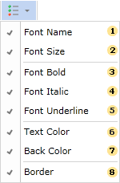

## Visual Styles Menu

It is possible to enable/disable visual styles of a component using the conditional formatting. Enabling/disabling visual styles can be done in the visual styles menu. This menu provides the ability to make choice of those visual styles of the component, which will be applied to it for triggering the condition. The picture below shows the menu of visual styles:

 The **Font Name** menu item. Enabling/Disabling this item provides an opportunity to change/not change the font in the components that match the condition;

 The **Font Size** menu item. Enabling/Disabling this item provides an opportunity to change/not change the font size for components that match the condition;

 The **Font Bold** menu item. Enabling of this item provides an opportunity to use bold font for the components that match to the condition;

 The **Font Italic** menu item. Enabling of this item provides an opportunity to use italic font for the components that match to the condition;

 The **Font Underline** menu item. Enabling of this item provides an opportunity to use the underlined font for components that match to the condition;

 The **Text Color** menu. Enabling of this item provides an opportunity to apply the text color for the components which correspond to the condition;

 The **Back Color** menu item. Enabling of this item provides an opportunity to apply the background color for the components that match to the condition;

 The **Border menu** item. Enabling of this item provides an opportunity to change the borders of components.
