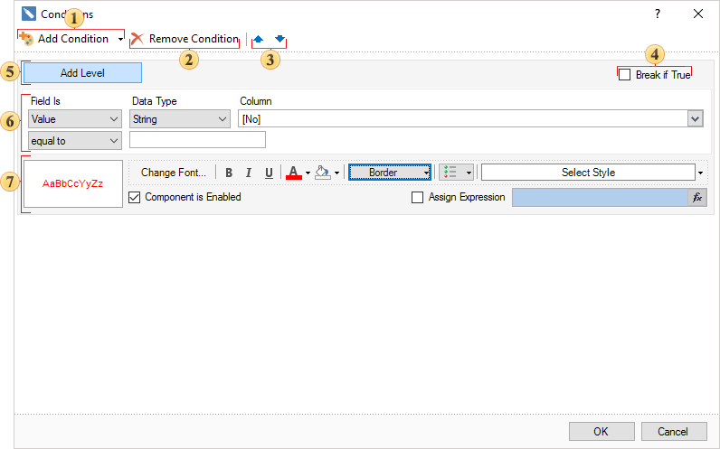

## Conditional Formatting

Conditional formatting allows you to change the design of components, depending on certain conditions. For each component in the record, you can set the conditions that define its formatting, such as font style, text color and background color. You can also hide or disable the component. For a component, you can set several conditions, ie appearance of the component may change in different ways depending on the conditions. Setting up conditional formatting is done using the properties of conditions (Conditions). Using this property is called the editor environment. The picture below shows the main elements of the editor of conditions:

 Add condition

This button adds a new conditional formatting to component conditions.

 Remove condition

This button removes a new conditional formatting from component conditions. It is necessary to select the conditional formatting.

 The buttons are used to move the selected level of conditions in the list. The higher the level is in the list, the higher is the priority of processing.

 Break if True

By default, all the conditions of the levels are processed sequentially from top to bottom. Depending on the result, these or that format settings are applied. If you want to stop the processing of conditions so that the processing of the condition stopped when returning true, you should check this setting. In this case, the levels will be processed sequentially until to return the value **true**. Thereafter, subsequent processing of conditions (levels below) will be terminated.

 Add level

This button adds one level of the condition parameter.

 **Parameters of a condition**

Specify parameters of condition on this panel.

 **Format settings**

Specify parameters of the appearance of the component on this panel.

There are two types of conditions - Value and Expression. How to set a condition is reviewed on next topics.
