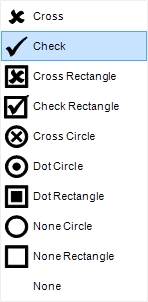
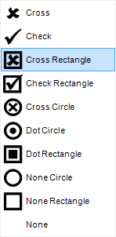
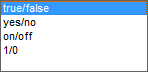

## Check Box

For displaying Boolean values, you can use the **Check Box** component. Various styles can be applied to it. The picture below shows the available styles of check boxes:

You can set a checkbox style to each Boolean value. To do this, select values of the Style property for True (Check style for **True**) and style values for False (Check style for **False**). You can also change the type of values.

selecting the necessary type in the property field **Values**.
