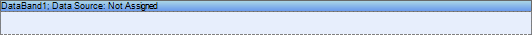
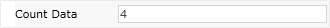
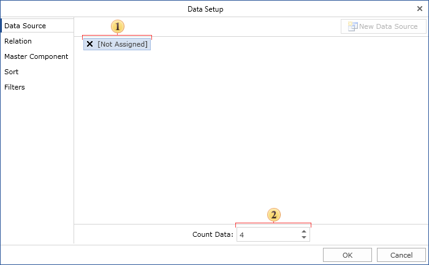

## Data Band

The basic band is the Data band. A data source is specified to each Data band. The data source is a table. Each data source has data fields. It is possible to output a table by placing text components with references to these fields. One data source can specify previously unknown number of rows with data. The Data band is output as many times as there are rows in the specified data source. For example, if there are 100 rows in the data source, then the Data bad will be output 100 times. If it is not enough space on one page, the second page will be generated and printing will be continued:

Virtual Data Band

Sometimes it is necessary to print a Data band several times without specifying a data source. The CountData property is used for this purpose.

It is possible to specify number of elements in the Data band editor. On the picture below the Data editor is shown.

 The field in what number of elements for the Data band can be specified.

 A data source is not specified.

By default the CountData property is 0. But if to set it to 4, then the Data band will be printed 4 times. This can be used to print empty columns. It is important to remember that in this case data source is not specified.
