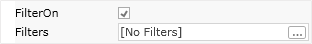
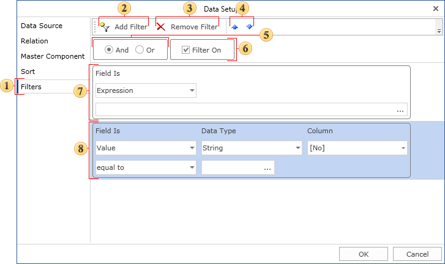
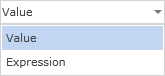
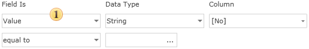
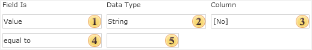
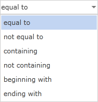
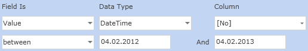
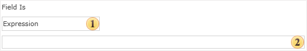

## Data Filtering

When rendering a report, sometimes it is necessary to print rows of the data source which correspond to the definite condition. To select the necessary rows the data filtering is used. Data filtering is set using the Filters property of the Data band. In addition to the Filters property the FilterOn property can also be used. This property controls filter activity.

How does the filter work? In each filter the condition is set. If the condition is set to true, this means that the result of its calculation is true, then this data row will be output. If the result of calculation is set to false, then this row will be ignored. Each band may contain more than one filter. For example it is necessary to check one of columns of the data source on the equality to the string constant and simultaneously the value of this column should start with the definite character. The filtering is setup in the window of the Data band setup (the Filters bookmark). On the picture below such a window is shown.

 The Filters bookmark;

 Filter panels. Each Data band may contain one or more filters;

 The button to select a new filter;

 The button to delete the selected filter;

 The type of logical operation, according to what filters will be formed. This field is available if the Data band contains more than one filter. There are two options: a logical And and logical Or. If you select the logical And, then data row will be output, if all filters are set to true. If you select the logical Or, then the data row will be output, if at least one of the filters is set to true;

 The Filter On flag is used to enable/disable filters of the data band.

Each filter is a condition for data row processing. There are two ways set a condition:

 Value. The condition is set using the wizard;

 Expression. The condition is set as an expression.

On the picture below, the figure 1 is the field in what the way of calculating condition is indicated.

How to set a condition using the wizard

On the picture below the panel of setting a condition using the wizard is shown.

 The way of selecting a condition;

 This field specifies the type of data with what the condition will work. There are five types of data: String, Numeric, DateTime, Boolean, Expression. Data type has affect on how the reporting tool processes a condition. For example, if the data type is a string, then the method of work with strings is used. In addition, depending on the data type the list of available operations of conditions is changed. For example, only for the String data type is Containing operation is available;

 The column of the data source is specified in the field. The value from this column will be used as the first value of a condition;

 The type of operation, using what the calculation of the value of a condition is done. All available types of operation are grouped in the table and shown on the picture below;

 The second value of a condition of a filter. It is required to specify two values for some operations. For example, for the between operation it is required to specify two values.

The table below shows operations and their description for each data type.

String

Numeric

Date

Logic

Expression

equal to

If the first value is equal to the second value, then the condition is true.

not equal to

If the first value is not not equal to the second value, then the condition is true.

between

If the first value is in the range, then the condition is true.

not between

If the first value is not in the range, then the condition is true.

greater than

If the first value is greater than the second value, then the condition is true.

greater than or equal to

If the first value greater than or equal to the second value, then the condition is true.

less than

If the first value is less than the second value, then the condition is true.

less then or equal to

If the first value is less then or equal to the second value, then the condition is true.

containing

If the first value contains the second value, then the condition is true. This operation can be applied only to strings.

not containing

If the first value does not contain the second value, then the condition is true. This operation can be applied only to strings.

beginning with

If the first value begins with the second value, then the condition is true. This operation can be applied only to strings.

ending with

If the first value ends with the second value, then the condition is true. This operation can be applied only to strings.

How to set a condition using as an expression

When using the Expression type of a condition, the condition is set as a text expression, that should return the Boolean value. The picture below shows parameters of settings:

 The way to select an expression;

 The expression is specified in this field. It should return the Boolean value. For example, the expression in C#:

Customers.ID == 53447

If the expression will return the value of not a Boolean type, then the reporting tool will not be able to render an expression of this type.
