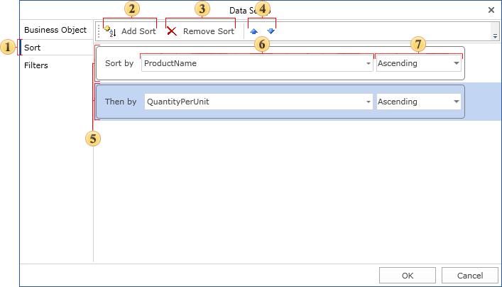
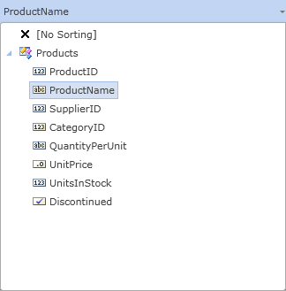

## Data Sorting

Frequently data, which are used for the report rendering, are sorted in order that does not to meet your requirements. In this case, it is possible to sort data using by abilities of Stimulsoft Reports. Sorting can be set for each **Data** band separately. To set sorting it is necessary to use the **Sort** property of the **Data** band. Using this property it is possible to call the editor of the **Data** band.

Also it is possible to call the editor by double-click on the band. The **Sort** bookmark is responsible for sorting in the band editor. The picture below shows structure of the bookmark of sorting.

 The Sort bookmark;

 The button to add a new level of sorting;

 The button to remove the selected level of sorting;

 Move the selected level of sorting upwards;

 Move the selected level of sorting downwards;

 Level of sorting;

 The column or expression which are used for sorting;

 The button to add or edit expressions of the sorting level;

 The button the select a column for sorting;

 Direction of sorting.

Each sorting consist of several levels. For example, the first list can be sorted by one column, then by the second column, then by the third column. On the picture above bookmark sorting, sorting levels are marked with figure 6. Number of levels of sorting is unlimited. Each level of sorting has the sort order. It is possible to sort in ascending order and in descending order. By default, sorting is set in ascending order. In addition to the sort order in each level of sorting the column (figure 9 on the picture above) is set or expression (figure 8 on the picture above) is set, which is used to obtain the values by which sorting will be done.

