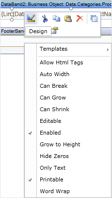
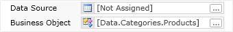
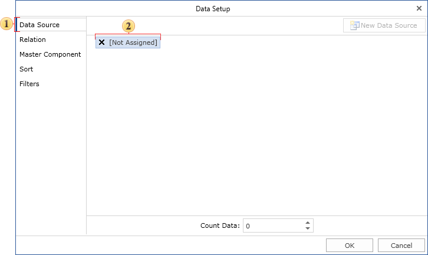
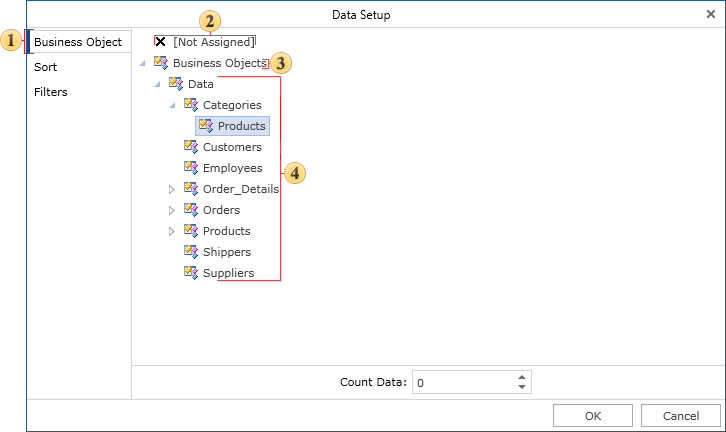
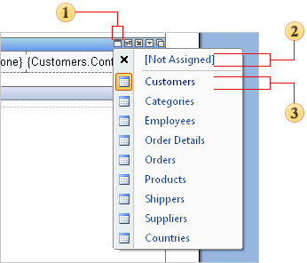

## Data Source of Data Band

It is necessary to specify what data source will be used when you output lists in the **Data** band. It is important because report generator should know how many times the **Data** band must be printed. Therefore, the reference to the **Data** band is specified. This can be done with several ways. First, it is possible to use the **Data** band editor. To call the editor it is enough double-click on the **Data** band. Also it is possible to call the editor from the context menu. See below an example of this menu.

Also the editor can be called using the **DataSource** property of the **Data** band.

**Data** band editor allows quickly selecting data source. Data source is selected on the first bookmark of the **Data** band editor. All data sources are grouped in categories. Each category is one data connection with data in the Dictionary of Data. The picture below shows data in the **Data** band editor.

 Select data source bookmark of the **Data** band.

 Select this node if there is no need to specify any data source.

 The "Demo" category of data.

 The "Demo" category of data source.

Second, it is possible to use quick button on the **Data** band and select data source from menu. Basic elements of menu are represented on the picture below.

 Quick button the select data source.

 This menu item is used to reset data source selection.

 The **Customers** data source is selected.
