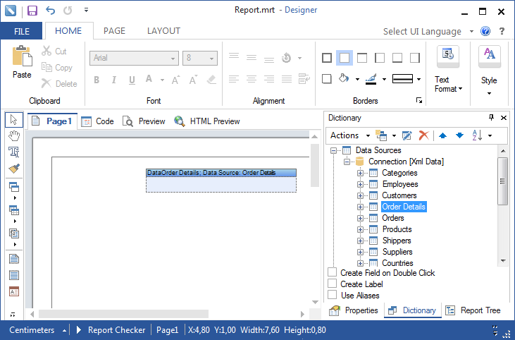
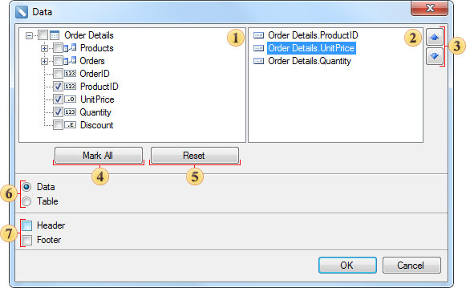

## Drag and Drop From Dictionary

The report designer supports a way of dragging components, including the data dictionary. You can drag and drop data sources, columns, variables, functions, and more. You can create a list simply by dragging the data source from the dictionary in the report template. The picture below shows an example of dragging the data source Order Details from the Dictionary on the report page.

After you release the left mouse button, you will see a dialog box Data, in which you should set the parameters of a new report template. Below is a Data dialog:

 This panel displays the columns which contain the data source and the connection between sources. If you need to select the column, references which will be present in the text components on the data band.

 This panel displays the selected data columns and their order. The order (top-down) on this panel is the order of arrangement of text components on the data band from left to right.

 These buttons are used to move the selected columns on the panel 

, thus changing the order of text components on the data band.

 The button **Mark All**. When clicking it, all columns (a checkbox is set to true) on the panel are selected.

 The button **Reset**. When clicking, it sets the selection parameters by default (checkbox is set to false), no column are selected.

 Selects a container for data: data band and a table.

 If you want to add bands Header and/or Footer into the report template, you should set the appropriate option.
