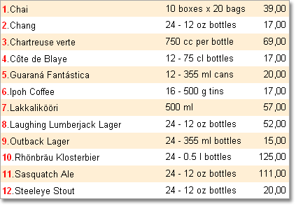
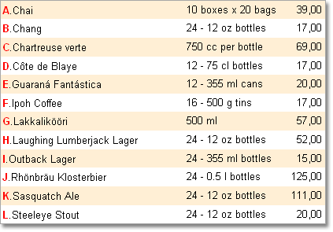
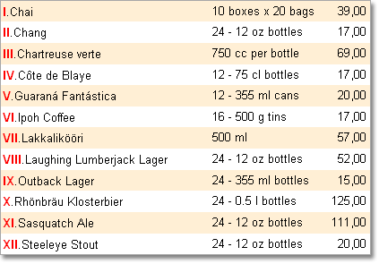

## Enumeration in Lists

Sometimes it is necessary to number lists. It is more convenient to work with an enumerated list. On the picture below an enumerated list is shown.

To add a number of a row into an expression it is possible to use the Line system variable. For example, the following expression can be used to get the result as is shown on the picture above:

{Line}.{Products.ProductName}

The Line system variable returns the number of the current row. Numeration starts with 1. In other words the system variable returns 1 for the first row, 2 for the second one and etc. This system variable has the Int64 type. The Line system variable may also be used in arithmetic expressions. If you need to start numeration from 0, it is necessary to use the following expression:

{Line - 1}.{Products.ProductName}

In addition to the Line, LineABC and LineRoman system variables can also be used for the list enumeration. The LineABC system variable returns the alphabetical index instead of a number of a row. The LineRoman system variable returns Roman numerals of a number of a row. For example, a report where the LineABC system variable is used is shown on the picture below:

A report where the LineRoman system variable is used is shown on the picture below:

LineABC and LineRoman  system variables, unlike the Line system variable, return numbers as strings. For example, to enumerate a list with letters in the lower case, it is possible to use the following expression:

{Line.ToLower()}.{Products.ProductName}
