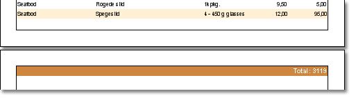
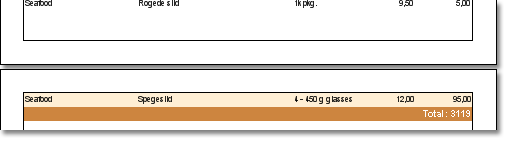

## KeepFooterTogether Property

The KeepFooterTogether property is used to print a list so that to output data row together with totals of data. If the property is true, then totals will be printed with the last row of data. If total cannot be placed after the last page printing, then it is output on the current page. If there is no enough free space to output totals, then it is carried over on the next page. On picture below a sample of a report with the KeepFooterTogether property set to false is shown.

And the same report with keeping footer together with the last row of data.

By default, the KeepFooterTogether property is set to true, so totals of data will be kept together with last row of data.
