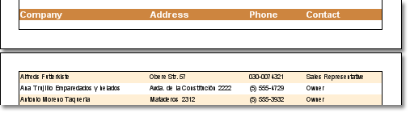
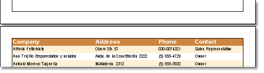

## KeepHeaderTogether Property

Sometimes, when printing lists, a header will be printed on one page, and the first row of data on another. To escape this visual gap of data the KeepHeaderTogether property of the Header band can be used. If the property is true, then headers will be printed together with data. In other words as minimum one row with data will be output. If there is no enough free space for a header with data row, then they will be carried over on the next page. See a sample of a rendered report with  the KeepHeaderTogether property set to false.

As the same report with keeping header together with the first data row.

By default, the KeepHeaderTogether property is set to true. So headers will be kept together with the first row of data.
