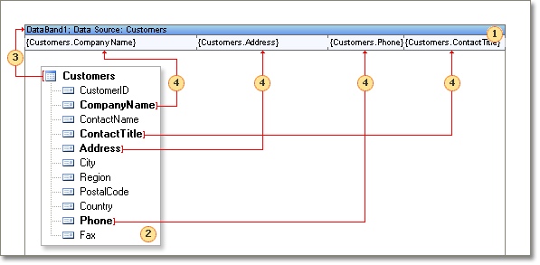
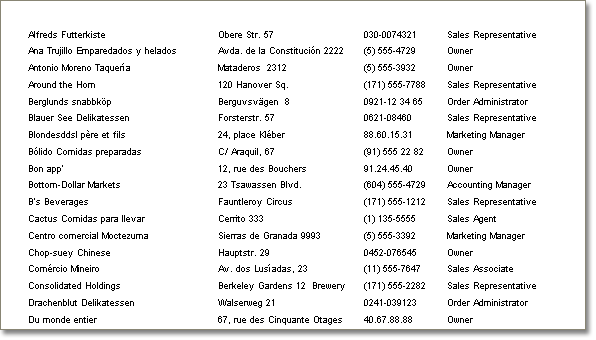

## List Output

Render a report that prints a list. Put one **Data** band on a page. Using the **DataSource** property assign a data source to the band. Put **Text** components on the band. Make a reference to data fields in each component. For example:

{Customers.CompanyName}

The report template will have the following view.

 **Data** band that outputs a table.

 The data source that is used to get data rows.

 Reference to the data source. It is necessary to specify data source to the **Data** band.

 Reference to the data source. **Text** components are placed on the **Data** band. References to data sources fields are created. When rendering, all references will be changed on data.

After report rendering all references to data fields will be changed with data from specified fields. Data will be taken from the data source, that was specified for this band. Number of copies of the **Data** band in the rendered report will be equal to the number of rows in the data source. As a result, all fields were output as a list. The picture below shows a rendered report.

If all lists cannot be placed on one page, then the report generator will add additional pages.
