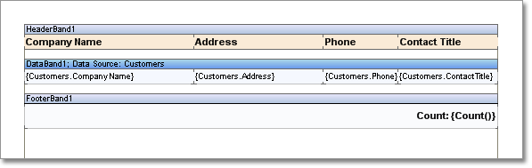
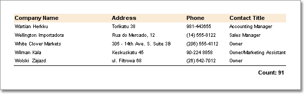

## List with Footer

Besides **Data** bands and **Headers** bands, **Footer** bands can be used. These bands are used to output total of data. The **Footer** band is placed after data are output. Different information is output in the band. For example, totals of a list, data, additional information. On the picture below a report template with the **Footer** band is shown.

As a result of report rendering with the **Footer** band, the report generator will output total after all data will be output. For example:

The **Data** band may have unlimited number of bands. Bands of totals will be output in the same order as they are placed on a page.

* **Notice:** For one Data band unlimited number of Footer bands can be created.
