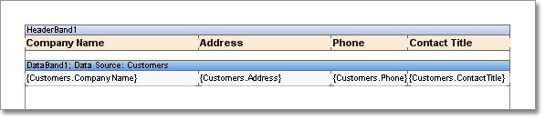
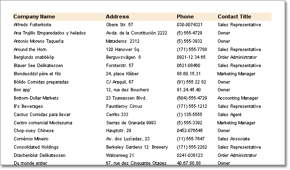

## List with Header

Usually, a name of a column is output over each column. To output data name or other information before data the special **Header** band is used. It is placed on a page before the **Data** band. There should not be any headers between the **Data** band and the **Header** band. On the picture below a sample of a report with one **Header** band and one **Data** band is shown.

Create a new report. Put a data band on a page. Add the **Header** band to a report. Put text components on a band. Specify data name, which are output on the **Data** band, in these text components. Increase the font size, make it bold. Change the text components background on the **Header** band. Render a report. The picture below shows the result of report rendering.

When report rendering for one **Data** band, it is possible to create more than one **Header** band. For example, one **Header** band can be output only in the beginning of data. And the second one can be output in the beginning of data and on other pages of a report. **Header** bands are output in the same order as they are placed on a page.

* **Notice:** For one Data band unlimited number of Header bands can be created.
