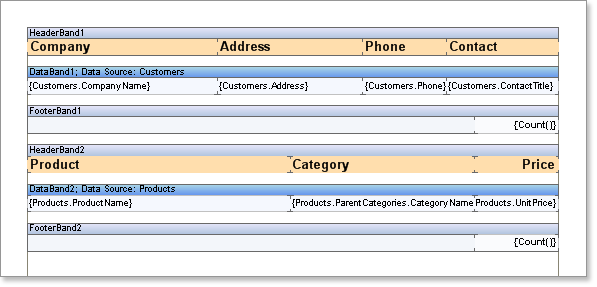
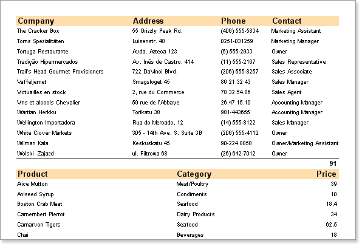

## Lists One After Another

Often it is necessary to output some lists one after another in a report. Stimulsoft Reports has no restrictions on it. All you have to do to render such a report is to place two **Data** bands with headers and footers bands. For example.

Put two **Data** bands on a page, specify them with different data sources. In addition create a header and a footer for the **Data** band. For this, place two **Header** bands and two **Footer** bands. How do you know which header and footer bands belong to the **Data** band? It's very simple. The **Header** band should be placed over the **Data** band. The **Footer** band should be placed under the **Data** band. Thus, the **Header** band or the **Footer** band are considered to belong to this **Data** band, if there are no other **Data** bands between them. For example, two bands of each type are placed on a page. The **HeaderBand1** band is placed over the **DataBand1** and there are no other **Data** bands between them. So it belongs to the **DataBand1**. But if to take the **DataBand2**, then between this band and the **HeaderBand1** band the **DataBand1** is placed. Therefore, the **HeaderBand1** does not belong to the **DataBand2**. The **FooterBand1** is placed under the **DataBand1** band and there are no other **Data** bands between them. So it belongs to the **DataBand1**. But the **FooterBand2** band is placed under the **DataBand1**, and the **DataBand2**. But there is the **DataBand2** in placed between the **DataBand1** and the **FooterBand2**. Therefore, the **FooterBand2** belong the the **DataBand2**. Here is an example of a report template, which outputs several lists one after another.

The first **Data** band will output the first list. When the list will be output the second list will be output. The second band will output on the second list. The number of lists is unlimited. The picture below shows the sample of how to output a report with with two lists.

