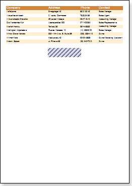
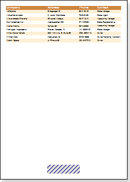

## PrintAtBottom Property

**HeaderBand** and **FooterBand** have the **PrintAtBottom** property.

Sometimes data take third part of a page and the data footer will be output right after the data ends.

The picture above shows data footer output after data.

If you want to output the footer on the bottom of the page, then set the **PrintAtBottom** property for the FooterBand to **true**.

The data footer will be displayed at the bottom of the page.

The default value of the property is set to **false**.
