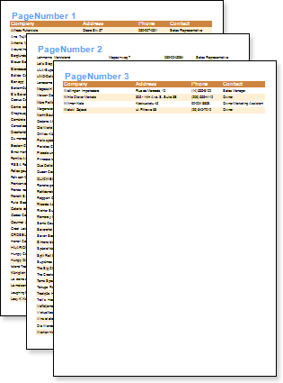
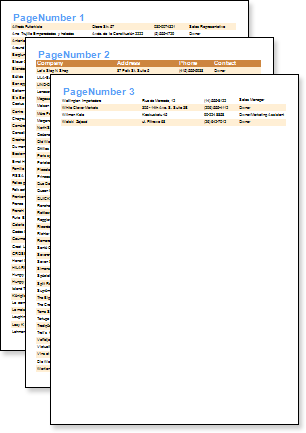

## PrintOnEvenOddPages Property

The PrintOnEvenOddPages property is used to print headers and footers on even/odd pages, for HeaderBands and FooterBands.

The picture above shows a sample of a report with the PrintOnEvenOddPages property of the HeaderBand set to OddPage.

The picture above shows a sample of a report with the PrintOnEvenOddPages property of the HeaderBand set to EvenPage.

Three values are available for this property:

 Ignore. Headers and footers are printed on all pages;

 PrintOnEvenPages. Headers and footers are printed on even pages;

 PrintOnOddPage. Headers and footers are printed on odd pages.
