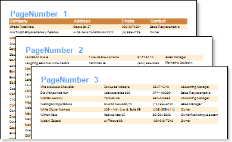

## PrintOn Property

The PrintOn property have all components including HeaderBand and FooterBand. This property is used to display a component on report pages according to the value of this property. If the property is set to **All pages**, then components will be shown as usually. If the property is set to any other value then the component will not be showing on the first/last page of a report or on the contrary will be shown on all pages except the first/last ones.

The **PrintOn** property has the following values:

 **All pages**;

 **ExceptFirstPage**;

 **ExceptLastPage**;

 **ExceptFirstAndLastPages**;

 **OnlyFirstPage**;

 **OnlyLastPage**;

 **OnlyFirstAndLastPages**.

The picture below shows a report sample with the **PrintOn** property of the **HeaderBand** set to **OnlyFirstPage**.

