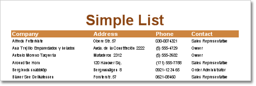
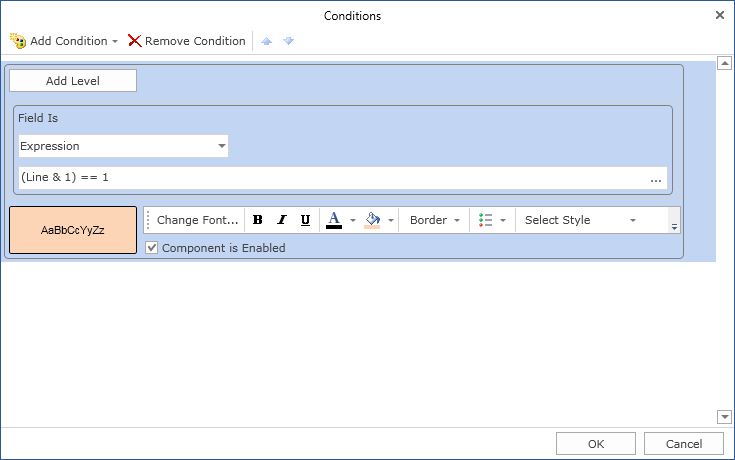
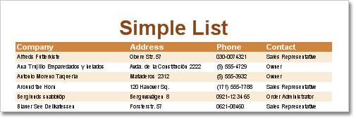
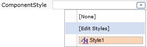

## Selecting Rows One After Another

To make a report look better and for much convenient work with rows it is recommended to alternate rows filled with different colors. This will make your report look professional. There are two ways in the report generator to make such filling: 1. using highlight conditions; 2. using special properties of the Data band styles.

The first way - using the Data band highlight condition. Open a report that has a list. An example of such a report is shown on the picture below.

All rows have the same background color. Add highlight condition to the Data band. The Conditions property of the band is used for this. Add a new condition in the editor, change background color on another color to fill odd rows, change text color (it is red by default) and set the highlight condition. The Line system variable is used to specify whether this row is odd or even. For example:

C#:

(Line & 1) == 1

VB.NET

(Line And 1) = 1

In other words for odd rows this condition is true. On the picture below the Conditions editor is shown.

After adding a condition to the data band a report will look as it shown on the picture below.

The second way - using properties of styles. The Data band has two special properties - OddStyle and EvenStyle. To add highlight condition to rows it is enough to specify a style in one of these properties. For example, the collection of styles has OddStyle. Select this style in the OddStyle property.

The report looks the same as the one where the first way was used.
