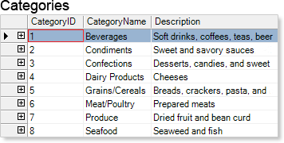
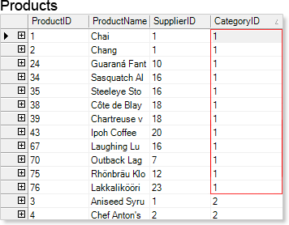
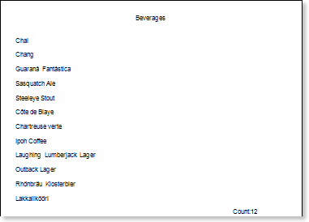
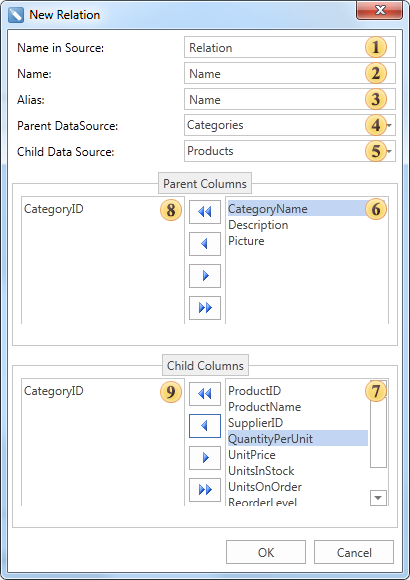
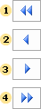

## Relation

If the Relation is not specified in the Master-Detail report, then, for each Master record, all Detail records will be printed. To build a Master-Detail report, which will print only those Detail records that are associated with this Master record, you should create a Relation between data sources. The Relation describes the relationship between data sources such as "master-detail". For example, in the table of the Categories data source in the CategoriesID data column, may be one record with a unique name 1, and in the table of the Products data source in the CategoriesID column data may be many records with the same unique name 1. The picture below shows an example of data source tables:

As can be seen from the picture above, one record with the name 1 in the table of the Categories data source corresponds to 12 records in the table of the Products data source. In other words, if you create a Relation by the CategoriesID column data between Categories and Products data tables, then when creating the Master-Detail report, the first Master record will correspond to Detail 12 entries. The picture below shows an example of the rendered Master-Detail report by CategoryName and ProductName columns, where the Relation is arranged between the Product and Category data sources by columns of CategoryID data:

The parameters of relations are specified in the New Relation window. To invoke this window, choose the New Relation item from the context menu of the data source or click the New Relation button form the Data Setup window in the Relation tab. The picture below shows an example of the New Relation window:

As can be seen on the picture above, nine fields, which define the relation parameters:

 The Name in Source field provides an opportunity to change the name of the data source (not in the report), the name in the original data source, for example, in a database;

 The Name field provides an opportunity to change the name of the relation that is displayed to a user;

 The Alias field provides an opportunity to change the alias of the relation;

 The Parent DataSource field provides an opportunity to change the main data source, the data source which entries are Master entries in the Master-Detail report is selected;

 The Child Data Source provides an opportunity to change the child data source, the data source which entries are Detail entries in the Master-Detail report is selected;

 This field displays the column-keys of the master data source;

 This field displays the column-keys of the child data source;

 -  fields shows the master and child data column-keys, which set the Relation between data sources. Column-keys should comply with all rules of creation relations in ADO.NET:

1 It should be the same number of them;

2 Their types should match, if the master column-key of the String type, then the child column-key should be of the String type;

3 And so on;

Control panel of data columns in the New Relation dialog box is represented by 4 buttons.

 The button to move all data columns from the field  or  in the field  or , respectively;

 The button to move the selected data column from the field  or  in the field  or , respectively;

 The button to move the selected data column from the field  or  in the field  or , respectively;

 The button to move all the data columns from the field  or  in the field  or , respectively.
